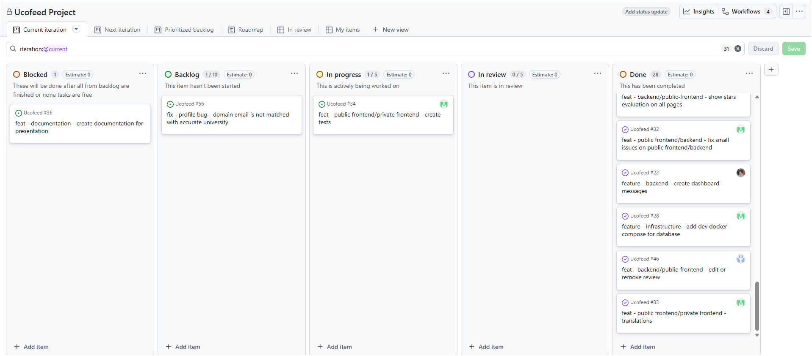
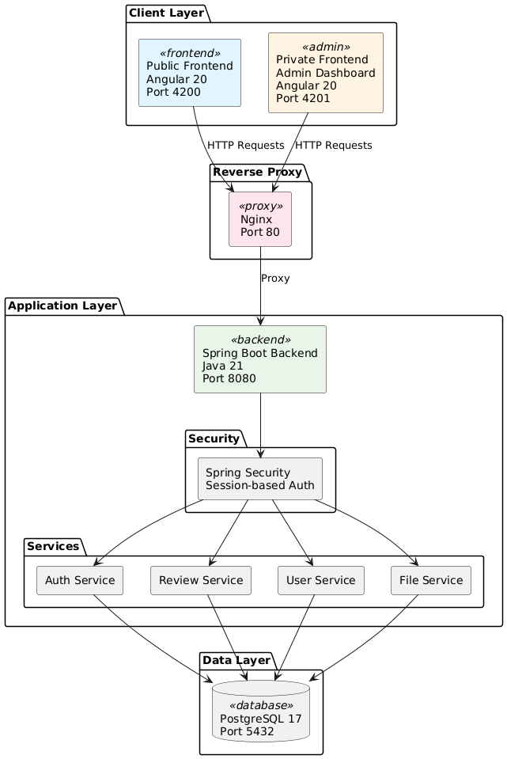
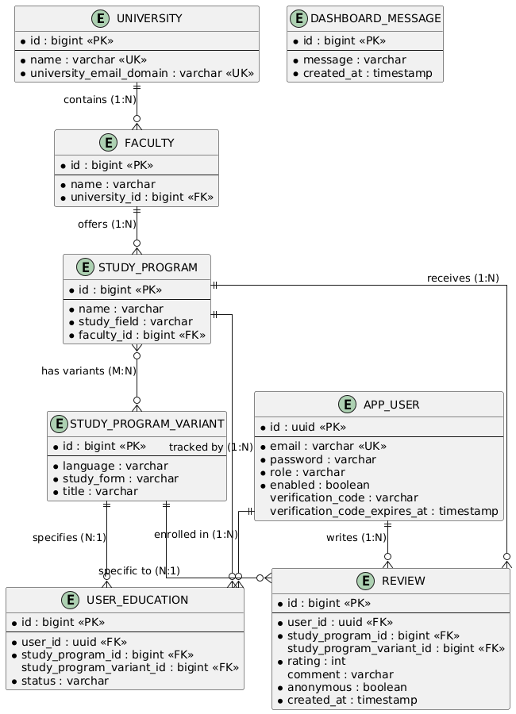
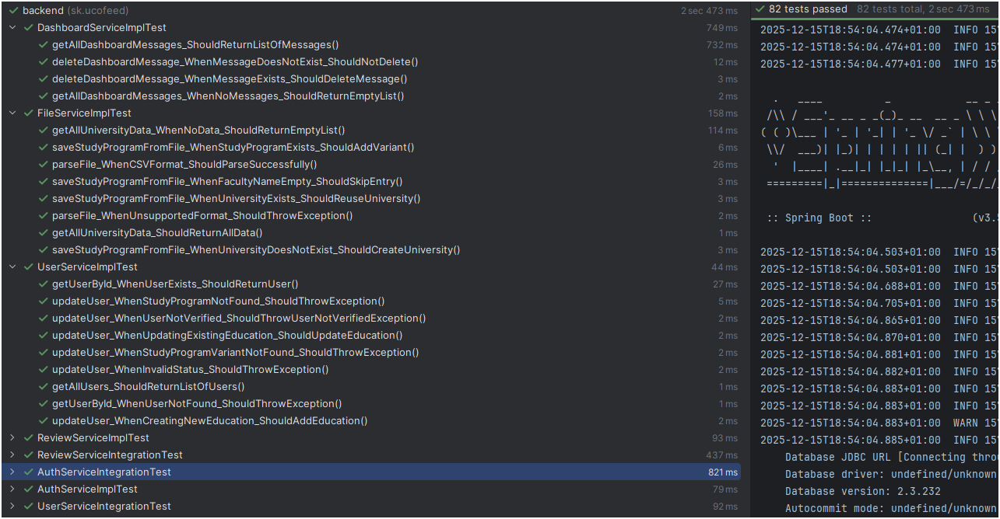
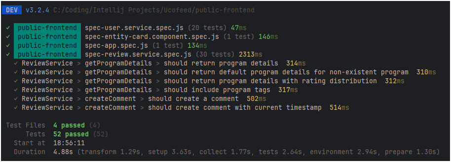
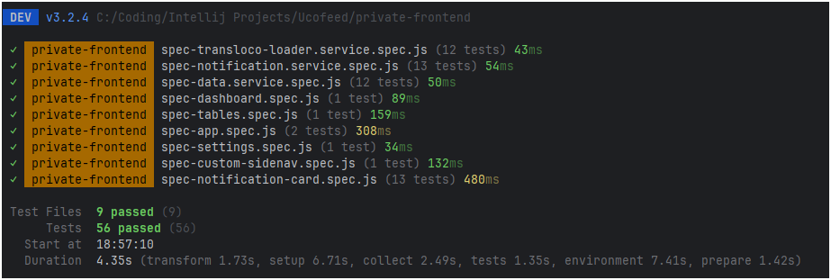

# Ucofeed - University Study Program Review Platform

**A verified review platform for Slovak university study programs**

Ucofeed helps prospective students make informed decisions about their academic future by providing authentic, enrollment-verified reviews from current and former students.

## Key Features

- **Verified Reviews**: Only enrolled students can review programs
- **Anonymous Feedback**: Students can share honest opinions safely
- **Hierarchical Navigation**: Browse universities → faculties → programs → reviews
- **Dual Interfaces**: Public portal for students + Admin dashboard for data management
- **Email Verification**: 6-digit code system with 15-minute expiration
- **Bulk Data Import**: CSV/Excel file upload for universities, faculties, and programs

---

## Table of Contents
- [Problem Statement](#problem-statement)
- [Core Features](#core-features)
- [Key Requirements](#key-requirements)
- [Project Timeline](#project-timeline)
- [Team](#team)
- [Architecture](#architecture)
- [Implementation](#implementation)
- [Tech Stack](#tech-stack)
- [How to Run](#how-to-run)
- [Testing](#testing)

---

## Problem Statement

Prospective university students in Slovakia lack reliable, student-generated feedback about study programs before enrollment. While platforms like RateMyProfessors exist for individual instructors, there is no comprehensive system for evaluating entire study programs from a student perspective.

**What Ucofeed provides:**
- Verified student reviews (enrollment-based validation)
- Anonymous feedback options to encourage honesty
- Hierarchical browsing of universities, faculties, and programs
- Aggregated ratings and statistics
- Support for program variants (degree types, study forms)

This platform helps students make informed decisions based on real experiences from their peers.

---

## Core Features

### Public User (Visitors & Prospective Students)
- Browse all Slovak universities, faculties, and study programs
- View reviews and ratings for any program without registration
- Filter programs by study form (full-time, part-time) and degree type (Bc., Mgr., Ing., PhD.)

### Registered Student
- Register with email verification (6-digit code, 15-minute expiration)
- Login with session-based authentication
- Manage profile and add study program enrollments
- Request new verification code if expired

### Enrolled Student (Review Authors)
- Write reviews for enrolled programs (rating 1-10 + optional comment up to 5000 chars)
- Choose to publish reviews anonymously
- Edit or delete own reviews
- View all submitted reviews in one place
- System validates enrollment before allowing review submission
- One review per program per student (enforced by database constraint)

### Admin User
- Upload CSV/Excel files with university data
- Preview parsed data before database import
- Monitor new reviews via dashboard notifications
- View all data in sortable, filterable tables
- See review author identity even for anonymous reviews

---

## Key Requirements

### Security
- BCrypt password hashing
- Session-based authentication with Spring Security
- Email verification required for account activation
- CORS configuration for frontend origins
- Enrollment validation prevents unauthorized reviews

### Usability
- Internationalization support (Slovak language via Transloco)
- Responsive design with Tailwind CSS and DaisyUI
- Clear error messages and validation feedback

### Data Integrity
- One review per user per program (unique constraint)
- Rating validation (1-10 range)
- Enrollment verification before review creation
- Unique email addresses (no duplicate accounts)
- Hierarchical data relationships enforced with foreign keys

---

## Project Timeline

**Duration**: September 30 - December 15, 2025 (2.5 months)

**Status**: Team implemented core features that were tracked with Github Issues



## Team

**Backend Development** - **Peter Červeň, Artur Andriichenko**
- Spring Boot REST API, database design, business logic, Spring Security
- Email verification system, file upload, data import features

**Public Frontend Development** - **Peter Červeň, Antonio Kiš, Andrej Király**
- User-facing Angular application (port 4200)
- University/faculty/program browsing, review system UI, authentication flows

**Private Frontend Development** - **Peter Červeň, Antonio Kiš, Andrej Király**
- Admin Angular application (port 4201)
- Dashboard notifications, file upload UI, data preview tables

**DevOps & Infrastructure** **Peter Červeň, Artur Andriichenko**
- Docker Compose orchestration, Nginx reverse proxy, PostgreSQL setup
- Environment configuration, Git workflow

**Team Leader** - **Peter Červeň**

**Team Members**: Antonio Kiš, Andrej Király, Artur Andriichenko, Peter Červeň

---

## Architecture

Ucofeed follows a **three-tier layered architecture** with separate client applications for public and admin users.

### Component Architecture



### Key Architectural Decisions

**Layered Monolith**
- Simpler than microservices for a small team
- Easier testing and deployment
- Clear separation: Controllers → Services → Repositories
- Single deployment unit reduces operational complexity

**Dual Frontend Approach**
- Public Frontend (port 4200): Student-facing features, review browsing/creation
- Private Frontend (port 4201): Admin dashboard, data management, monitoring
- Shared backend REST API with role-based access control
- Separate Angular projects allow independent development and deployment

**Session-Based Authentication**
- More secure than stateless JWT for this use case
- Server-side session storage with Spring Security
- Easy session revocation (logout, security events)
- No token expiration management in frontend
- Suitable for web-only application (no mobile apps yet)

---

## Implementation

### Database Schema

**8 Core Entities:**



**Entity Descriptions:**
- `university`: Slovak universities (~30 records)
- `faculty`: Faculties within universities (~200 records)
- `study_program`: Study programs offered (~2,000 records)
- `study_program_variant`: Program variants by degree type and study form (~50 records)
- `app_user`: Registered users with BCrypt-hashed passwords (~500 records)
- `review`: Student reviews with ratings 1-10 (~1,200 records)
- `user_education`: Enrollment tracking with status (ENROLLED, ON_HOLD, COMPLETED, DROPPED_OUT)
- `dashboard_message`: Admin notifications for new reviews

**Key Constraints:**
- `review(user_id, study_program_id)`: One review per user per program (unique constraint)
- `app_user.email`: Unique email addresses
- `review.rating`: constraint (1-10)
- `user_education.status`: constraint (ENROLLED, ON_HOLD, COMPLETED, DROPPED_OUT)

---

### Backend API (Key Endpoints)

**Base URL**: `http://localhost:8080/api`

| Endpoint | Method | Description |
|----------|--------|-------------|
| **Authentication** |
| `/auth/register` | POST | Register new user account with email |
| `/auth/login` | POST | Authenticate user, create session |
| `/auth/verify` | POST | Verify email with 6-digit code |
| `/auth/logout` | POST | Invalidate session |
| `/auth/resend-verification-code` | POST | Request new verification code |
| **Reviews** |
| `/review` | POST | Create review (enrolled students only) |
| `/review/{id}` | PUT | Update own review |
| `/review/{id}` | DELETE | Delete own review |
| `/review/study-program/{id}` | GET | Get all reviews for study program |
| `/review/my-reviews` | GET | Get all reviews by authenticated user |
| **Universities & Programs** |
| `/university` | GET | List all universities |
| `/university/{id}` | GET | Get university details with faculties |
| `/faculty/{id}/study-programs` | GET | Get study programs by faculty |
| `/study-program/{id}` | GET | Get study program details |
| **User Management** |
| `/user` | GET | Get authenticated user profile |
| `/user` | PUT | Update user profile |
| `/user/education` | POST | Add enrollment to profile |
| **Admin Only** |
| `/admin/file/parse-file` | POST | Parse CSV/Excel file, return preview |
| `/admin/file/upload-data` | POST | Bulk import parsed data to database |
| `/admin/dashboard/messages` | GET | Get new review notifications |
| `/admin/dashboard/messages/{id}` | DELETE | Delete notification |

**Authentication**: Session-based with `JSESSIONID` cookie. Protected endpoints require valid session.

**Validation**: Spring Validation annotations on DTOs. Example: `@Email`, `@NotBlank`, `@Size(min=1, max=10)`

**Error Handling**: Global exception handler returns standardized error responses with HTTP status codes.

---

### Frontend Pages

#### Public Frontend (Port 4200)

| Page | Route | Description |
|------|-------|-------------|
| **Universities** | `/universities` | Browse all Slovak universities with search |
| **Faculties** | `/universities/{id}/faculties` | View faculties within selected university |
| **Programs** | `/faculties/{id}/programs` | View study programs offered by faculty |
| **Reviews** | `/programs/{id}/reviews` | View and create reviews for study program |
| **Profile** | `/profile` | User profile with enrollment management and "My Reviews" section |
| **Register** | `/register` | Registration form with email verification |
| **Login** | `/login` | Login form with session creation |

**Key Features**:
- Hierarchical navigation with breadcrumbs
- Rating statistics (average, distribution)
- Anonymous review toggle
- Enrollment-based review authorization
- Internationalization (Slovak via Transloco)

#### Private Frontend (Port 4201)

| Page | Route | Description |
|------|-------|-------------|
| **Dashboard** | `/dashboard` | Real-time notifications for new reviews |
| **Tables** | `/tables` | View all data (universities, faculties, programs, users, reviews) |
| **Settings** | `/settings` | File upload, data import with preview |

**Key Features**:
- Sortable, filterable data tables
- CSV/Excel file upload with preview
- Bulk data import validation
- Review author visibility (even for anonymous reviews)

---

## Tech Stack


| Category | Technology | Reason | Alternatives |
|----------|-----------|--------|--------------|
| **Frontend** | Angular 20 | Full framework, TypeScript, dual frontends | React, Vue, Svelte |
| **UI Library** | Tailwind CSS 4 + DaisyUI | Utility-first, rapid development | Bootstrap, Material |
| **Backend Language** | Java 21 | LTS, team familiarity, ecosystem | Python, Node.js, Go |
| **Backend Framework** | Spring Boot 3.5.6 | Security, JPA, production-ready | Django, Express |
| **Database** | PostgreSQL 17 | Relational model, ACID, open-source | MySQL, MongoDB |
| **Auth Strategy** | Session-based | Security, simplicity, revocation | JWT, OAuth 2.0 |
| **Containerization** | Docker Compose | Easy local dev, portable | Kubernetes |
| **Reverse Proxy** | Nginx | Industry standard, CORS handling | Traefik, HAProxy |
| **File Parsing** | Apache POI + Commons CSV | Excel/CSV support | Custom parsers |
| **I18n** | Transloco | Angular integration | ngx-translate |

### Key Justifications

**Angular 20**: Full-featured framework with TypeScript, excellent for building two separate frontends (public + admin) with shared patterns. Strong ecosystem for enterprise applications.

**Spring Boot 3.5.6**: Industry-standard Java framework with excellent Spring Security integration, Spring Data JPA for database access, and mature ecosystem. Ideal for session-based authentication and transactional operations.

**PostgreSQL 17**: Open-source relational database with ACID guarantees, perfect for hierarchical data (universities → faculties → programs) and complex constraints. Superior support for UUID primary keys and constraints.

**Session-Based Auth**: More secure than stateless JWT for web-only applications. Server-side session storage allows instant revocation, no token management in frontend, and better protection against XSS/CSRF attacks.

**Docker Compose**: Simplifies local development with single-command setup. Orchestrates backend, frontends, database, and Nginx reverse proxy. Portable across team members' machines.

---

## How to Run

### Prerequisites

Before running the application, ensure you have the following installed:
- **Docker Desktop** (Windows/Mac) or **Docker Engine + Docker Compose** (Linux)
- **Git** for cloning the repository

For local development without Docker, you'll also need:
- **Java 21** (Amazon Corretto or OpenJDK)
- **Node.js 24+** with npm
- **PostgreSQL 14+**
- **Maven 3.9+** (or use included `./mvnw` wrapper)

### Option 1: Full Stack with Docker (Recommended)

This is the easiest way to run all services together.

```bash
# 1. Clone repository
git clone https://github.com/PeterCerven/Ucofeed.git
cd Ucofeed

# 2. Configure environment variables
# Copy example files to actual .env files
cp backend/.env.example backend/.env
cp infrastructure/database/.env.example infrastructure/database/.env

# Note: The .env.example files already contain default values:
# - Database: ucf
# - Username: user
# - Password: password
# You can use these defaults or edit the .env files with your own credentials

# 3. Start all services
cd infrastructure
docker-compose up --build

# Wait for all services to start (this may take 2-3 minutes on first run)
```

**Access the applications:**
- **Public Frontend**: http://localhost:4200 (Student-facing interface)
- **Private Frontend**: http://localhost:4201 (Admin dashboard)
- **Backend API**: http://localhost:8080/api (REST API)
- **Mailhog (Email Testing)**: http://localhost:8025 (View verification emails)
- **Nginx Proxy**: http://localhost:80 (Reverse proxy routing)


### Option 2: Local Development (Database Only in Docker)

If you want to run backend/frontends locally for development but use Docker for database:

```bash
# 1. Start only PostgreSQL and Mailhog
cd infrastructure
docker-compose -f docker-compose.db.yml up

# 2. In separate terminals, run each service:

# Terminal 1 - Backend
cd backend
./mvnw spring-boot:run
# Backend will run on http://localhost:8080

# Terminal 2 - Public Frontend
cd public-frontend
npm install
npm run dev
# Public frontend will run on http://localhost:4200

# Terminal 3 - Private Frontend
cd private-frontend
npm install
npm run dev
# Private frontend will run on http://localhost:4201
```

## Testing

### Running Tests

```bash
# Backend tests (82 tests)
cd backend
./mvnw test

# Public Frontend tests (52 tests)
cd public-frontend
npm test

# Private Frontend tests (56 tests)
cd private-frontend
npm test
```

### Backend (Java Spring Boot)

**Technologies:** JUnit 5, Mockito, Spring Boot Test, H2 Database (in-memory for integration tests)

**Types of Tests:**
- **Unit tests** – testing individual services in isolation with mocked dependencies
- **Integration tests** – testing services with a real database (H2)

**Total number of tests:** 82



---

### Public Frontend (Angular)

**Technologies:** Vitest, Angular Testing Library, HttpTestingController, JSDOM

**Types of Tests:**
- **Service tests** – testing HTTP communication with the backend
- **Component tests** – testing components and their behavior

**Total number of tests:** 52



---

### Private Frontend (Angular)

**Technologies:** Vitest, Angular Testing Library, HttpTestingController, JSDOM

**Types of Tests:**
- **Service tests** – testing data services and notifications
- **Component tests** – testing UI components
- **Page tests** – testing entire pages

**Total number of tests:** 56



---

